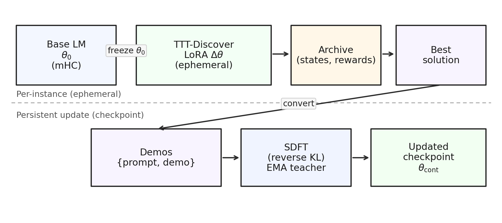
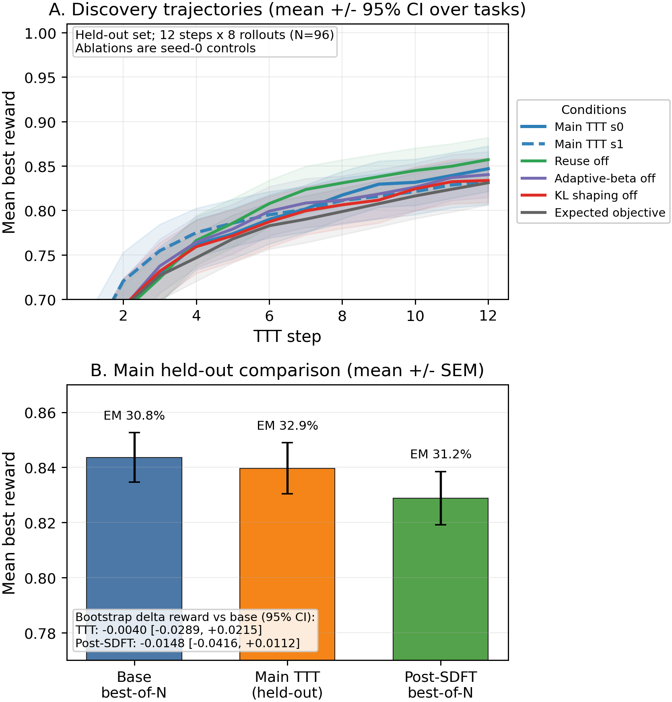

# Discover-Then-Distill: Compute-Matched Test-Time Adaptation and Self-Distillation

<p>
  <a href="https://github.com/aliuyar1234/discover-then-distill/releases/download/v1.0/DiscoverThenDistill_ComputeMatched_v2_2026-02-13.pdf">
    
  </a>
  
  
  
</p>

This repository contains the full research implementation and manuscript artifacts for:

**Discover-Then-Distill: Separating test-time LoRA adaptation from persistent self-distillation consolidation in language models under compute-matched evaluation.**

## Paper

- Canonical PDF: `paper/DiscoverThenDistill_ComputeMatched_v2_2026-02-13.pdf`
- Canonical LaTeX source: `paper/latex/`
- Canonical figures: `paper/figs_compute_v2/`

Short paper summary:

- Setting: compute-matched comparison against best-of-N under a fixed sample budget.
- Main result: TTT improves exact-match rate but not mean held-out reward in this profile.
- Consolidation result: retention remains stable (delta PPL = -1.321), while held-out reward transfer is mixed.

## Key Results (Compute-Matched v1 Profile)

| Condition | Mean reward | EM (%) | Delta vs base |
| --- | ---: | ---: | ---: |
| Base best-of-N | 0.8436 | 30.8 | -- |
| Main TTT (held-out) | 0.8396 | 32.9 | -0.0040 |
| Post-SDFT best-of-N | 0.8288 | 31.2 | -0.0148 |

Retention diagnostic:

- Validation perplexity delta after SDFT: **-1.321**

## Visual Overview

<p align="center">
  
</p>

<p align="center">
  
</p>

## Repository Structure

```text
configs/                     model and training configs
data/                        lightweight data artifacts (tokenizer, packed shards, synthetic tasks)
docs/                        blueprint notes and paper references
paper/
  DiscoverThenDistill_*.pdf  release manuscript
  figs_compute_v2/           publication figures (pdf/png)
  latex/                     manuscript source
  scripts/                   orchestration and tracking helpers
  plot_*.py                  figure builders
src/llm_mhc_sdft_tttd/       core research code (mHC, SDFT, TTT)
scripts/                     primary CLI entrypoints
tests/                       unit and smoke tests
```

## Reproduce Manuscript and Figures

Environment setup:

```bash
python -m venv .venv
source .venv/bin/activate
pip install -U pip
pip install -e .[dev]
pytest -q
```

Regenerate publication figures:

```bash
python paper/plot_pipeline_diagram.py --fig_dir paper/figs_compute_v2
python paper/plot_results.py --runs_dir runs/suite_fast_v1 --fig_dir paper/figs_compute_v2 --heldout_tasks data/discovery/heldout.jsonl
python paper/plot_run_timeline.py --state_ab runs/orchestrator/state.json --state_cf runs/orchestrator_fast_v1/state.json --fig_dir paper/figs_compute_v2
```

Build paper PDF:

```bash
powershell -ExecutionPolicy Bypass -File paper/latex/build_release.ps1
```

## Reproducibility Policy

- The repository is kept **source-first** for a clean public release.
- Large generated artifacts (`runs/`, checkpoints, temporary bundles) are excluded via `.gitignore`.
- Result claims in the manuscript are tied to tracked experiment logs and registries under `paper/`.

## GitHub Release Workflow (GH CLI)

```bash
gh repo create discover-then-distill --public --source . --push \
  --description "Compute-matched study of test-time discovery and self-distillation consolidation for language models"
```

Optional first release:

```bash
gh release create v1.0.0 paper/DiscoverThenDistill_ComputeMatched_v2_2026-02-13.pdf \
  --title "v1.0.0 - Compute-Matched v2 Paper Release" \
  --notes "Initial public paper release with source and publication figures."
```

## Citation

```bibtex
@misc{uyar2026discoverthendistill,
  title        = {Discover-Then-Distill: Separating Test-Time Adaptation from Self-Distillation Consolidation},
  author       = {Ali Uyar},
  year         = {2026},
  howpublished = {GitHub repository manuscript release},
  note         = {Compute-Matched v2, released 2026-02-13}
}
```
